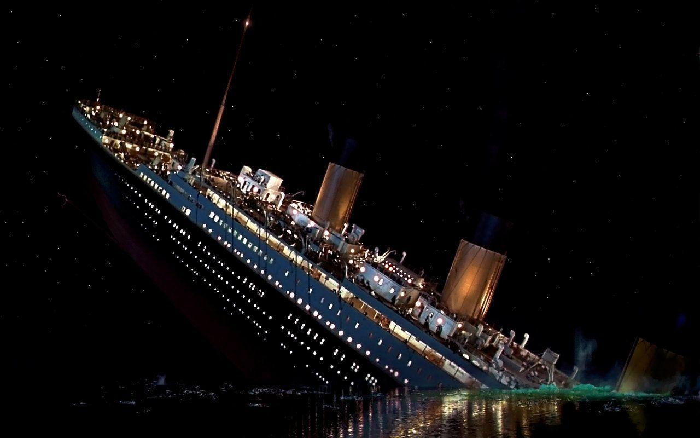
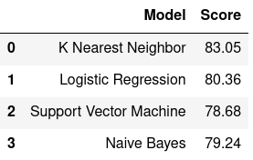

# Titanic-Machine-Learning-From-Disaster-Using-Scikit-Learn

  

# 1. Introduction

This project highlights my approach to the introductory machine learning competition on Kaggle website- Titanic: Machine Learning from Disaster.The sinking of the RMS Titanic is one of the most infamous shipwrecks in history. On April 15, 1912, during her maiden voyage, the Titanic sank after colliding with an iceberg, killing 1502 out of 2224 passengers and crew.In this project I analyses which people were likely to survive. In particular, famous machine learning tools which is scikit-learn is used for this implementation.

# 2. Objective

Knowing from a training set of samples listing passengers who survived or did not survive the Titanic disaster, can our model determine based on a given test dataset not containing the survival information, if these passengers in the test dataset survived or not.

# 3. Scikit-Learn 

Known as sklearn and largely written in Python, and uses NumPy extensively for high-performance linear algebra and array operations.Scikit-learn integrates well with many other Python libraries, such as Matplotlib and plotly for plotting, NumPy for array vectorization, Pandas dataframes, SciPy, and many more. 

 * Simple and efficient tools for predictive data analysis
 * Accessible to everybody, and reusable in various contexts
 * Built on NumPy, SciPy, and matplotlib
 * Open source, commercially usable - BSD license

# 4. Results 

The table above shows the results of the implementation.
We can clearly see the percentage difference in using different models with different Machine Learning techniques.

* K Nearest Neighbor gives the highest score because it is effective for large training dataset.
* Support Vector Machines(SVM) gives the lowest score because it takes long training time for large datasets.

# 5. References
https://en.wikipedia.org/wiki/Scikit-learn

https://www.kaggle.com/c/titanic

